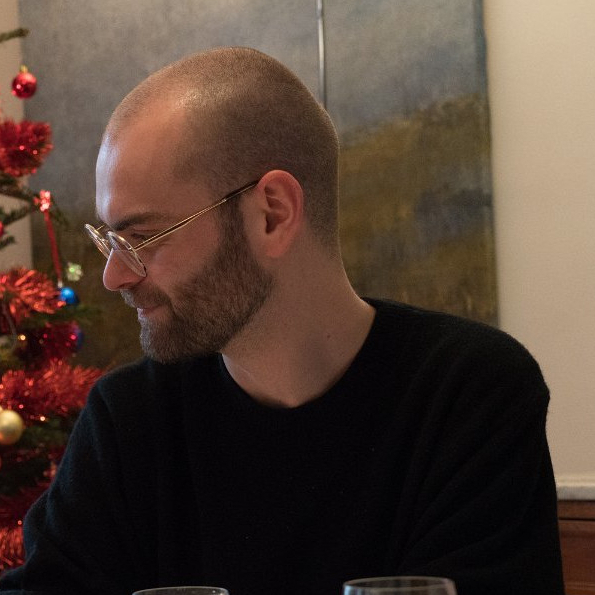

# Pierre Gervais

## Présentation et contacts



Actuellement postdoctorant à l'Université de Lille, membre de l'équipe [RAPSODI (Inria)](https://team.inria.fr/rapsodi/fr/) au sein du [laboratoire Paul Painlevé](https://math.univ-lille.fr/), dans le cadre d'une colaboration avec [Maxime Herda](http://chercheurs.lille.inria.fr/herda/), et financé par un contrat [CPER du CNRS](https://www.hauts-de-france.cnrs.fr/fr/une-excellence-de-la-recherche-academique), mes recherches concernent principalement l'analyse asymptotique d'équations cinétiques décrivant des gaz ou des plasmas.

J'ai intégré en 2014 la double licence Mathématiques-Informatique de l'Université Paris-Diderot, puis, en 2017, son master de Mathématiques fondamentales. J'ai ensuite commencé mon doctorat en 2019 sous la direction d'[Isabelle Gallagher](https://www.math.ens.fr/~gallagher/) et [Isabelle Tristani](http://tristani.perso.math.cnrs.fr), et soutenu ma thèse le 15 décembre 2022 [dont vous pouvez trouver le manuscrit ici](https://u-paris.fr/theses/detail-dune-these/?id_these=5448). J'ai fait mon premier postdoctorat de 2022 à 2023 sous la direction de [Bertrand Lods](https://sites.google.com/site/bertrandlods/) à l'Université de Turin.

Vous pouvez me contacter à l'adresse ```pierre.gervais [ at ] inria.fr```.

## Travaux de recherche

### Prépublications
- Hypoellipticity and averaging lemmas with a confining potential [(HAL-04823671)](https://hal.science/hal-04823671)
- Well-posedness and long-time behavior for self-consistent Vlasov-Fokker-Planck equations with general potentials (avec Maxime Herda) [(ArXiv:2408.16468)](http://arxiv.org/abs/2408.16468)
- Conditional integrability and stability for the homogeneous Boltzmann equation with very soft potentials (avec Ricardo Alonso et Bertrand Lods) [(ArXiv:2403.15613)](https://arxiv.org/abs/2403.15613)

### Publications
- Hydrodynamic limits for conservative kinetic equations: a spectral and unified approach in the presence of a spectral gap (avec Bertrand Lods)
  
  [_Annales Henri Lebesgue_](https://ahl.centre-mersenne.org/item/AHL_2024__7__969_0/) **7** (2024),  p. 968-1098.  [(ArXiv:2304.11698)](https://arxiv.org/abs/2304.11698)

- Non-cutoff Boltzmann equation with soft potentials in the whole space (avec Kleber Carrapatoso)

  [_Pure and Applied Analysis_](https://msp.org/paa/2024/6-1/p06.xhtml) **1** (2024), n° 6,  p. 253-303.  [(ArXiv:2212.04315)](https://arxiv.org/abs/2212.04315)

- On the convergence from Boltzmann to Navier-Stokes-Fourier for general initial data

  [_SIAM Journal on Mathematical Analysis_](https://epubs.siam.org/doi/10.1137/22M1471687) **55** (2023), n° 2,  p. 805-848.  [(ArXiv:2201.02825)](https://arxiv.org/abs/2201.02825)

- Spectral study of the linearized Boltzmann operator in $L^2$ spaces with polynomial and Gaussian weights

  [_Kinetic & Related Models_](https://www.aimsciences.org/article/doi/10.3934/krm.2021022) **14** (2021), n° 4,  p. 725-747.  [(HAL-02962516)](https://hal.archives-ouvertes.fr/hal-02962516)

## Communications orales
- 8/01/25 — Journées jeunes EDPistes de France (Nice) : Vlasov-Fokker-Planck with general potentials.
- 3/12/24 — Séminaire d'EDP de l'Université Libre de Bruxelles : Vlasov-Fokker-Planck with general potentials.
- 10/10/24 — Modeling, theory and numerics for PDEs (kinetic and hyperbolic systems) : Hydrodynamic limit of elastic kinetic equations by a spectral approach.
- 24/06/24 — France-Korea webinar : Hydrodynamic limit of elastic kinetic equations by a spectral approach.
- 20/06/24 — Kinetic equation, Mathematical Physics and Probability (BCAM) : Hydrodynamic limit of elastic kinetic equations by a spectral approach.
- 28/03/24 — Séminaire EDP de l'IRMAR (Université de Rennes) : Hydrodynamic limit of elastic kinetic equations by a spectral approach.
- 19/03/24 — Séminaire des post.doctorants (Université de Lille) : Hydrodynamic limit of elastic kinetic equations by a spectral approach.
- 16/10/23 — Séminaire d'équipe ANEDP (Université de Lille) : Navier-Stokes limit of conservative bilinear kinetic equations.
- 06/06/23 — Asymptotic Behaviors of systems of PDEs arising in physics and biology 5 : Navier-Stokes limit of conservative bilinear kinetic equations.
- 27/10/22 — Quantitative Analysis of Metastable Processes : On the Boltzmann equation with long range interactions.
- 11/1/22 — Applied Analysis Seminar : Hydrodynamic modes and limits of the Boltzmann equation in large functional spaces.
- 9/12/21 — Séminaire des thésards de l'IMJ-PRG : From Boltzmann to incompressible Navier-Stokes.
- 18/11/21 — Asymptotic Behaviors of systems of PDEs arising in physics and biology 4 : From Boltzmann to Navier-Stokes with initial data with polynomial decay.
- 28/10/21 — Congrès des Jeunes Chercheurs en Mathématiques Appliquées : Problèmes de limites hydrodynamiques.
- 22/10/21 — Workshop : Modèles et méthodes pour les équations cinétiques : From Boltzmann to Navier-Stokes with initial data with polynomial decay.
- 14/10/21 — ANR Entropie, Flots et Inégalités (EFI) : From Boltzmann to Navier-Stokes with general initial data.
- 6/10/21 — Rentrée du DMA : Problèmes de limites hydrodynamiques.

## Enseignement
- 2025 : Équations différentielles (TD et TP python)
- 2023 — Intégrale et séries de Fourier
- 2022 - Algèbre et analyse élémentaire 2
- 2022 - Colles
- 2021 - Modélisation pour les biologistes
- 2021 - Colles
- 2021 - Algèbre et analyse élémentaire 2
- 2019 - Interactions Maths-Physique
- 2020 - Colles
- 2019 - Analyse fonctionnelle I
